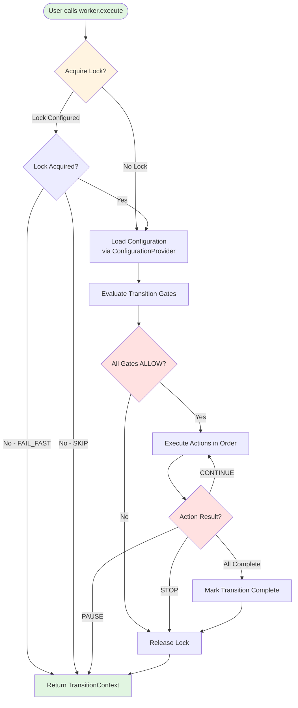
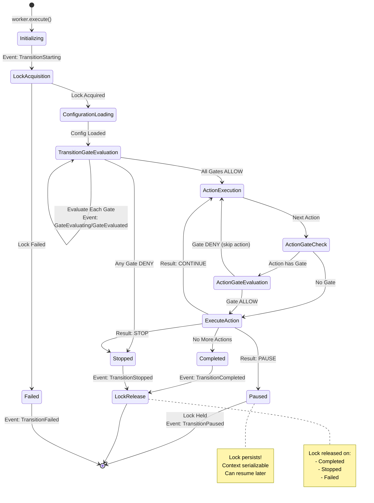
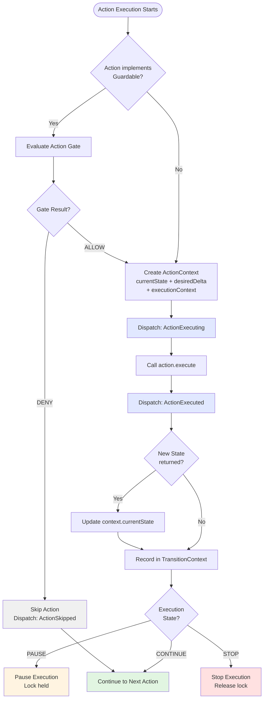
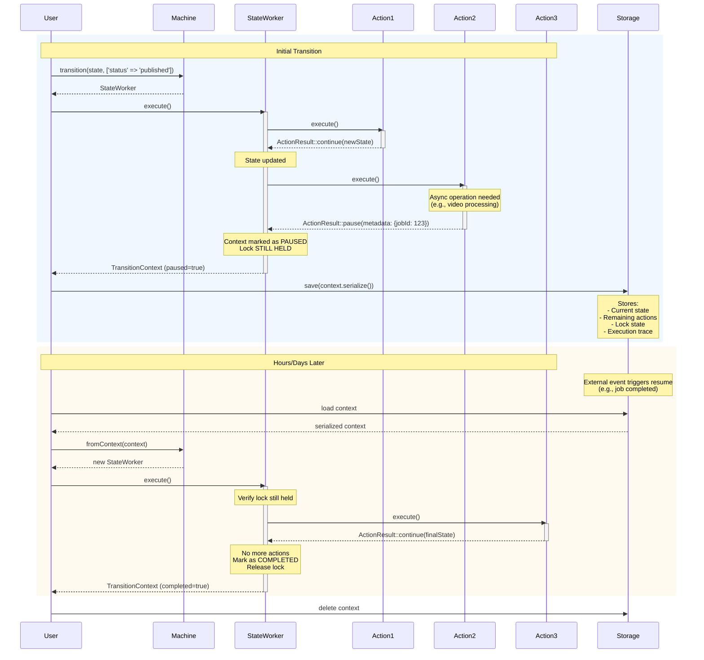
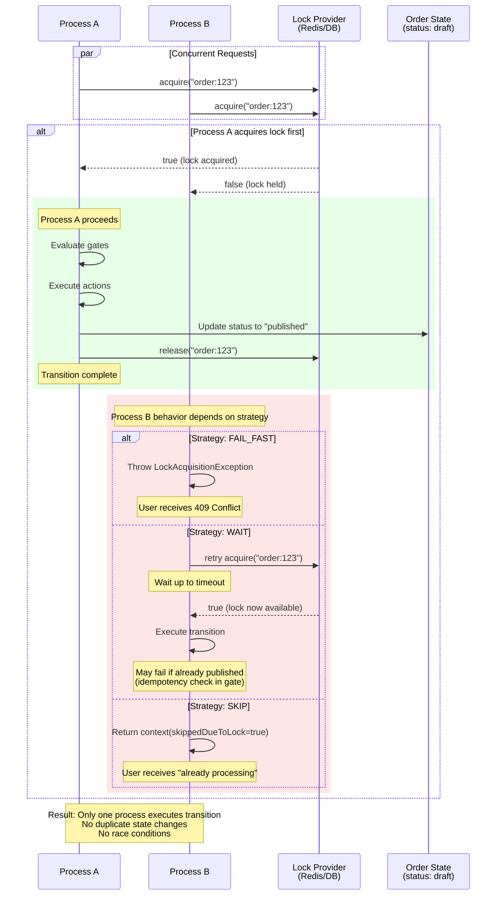
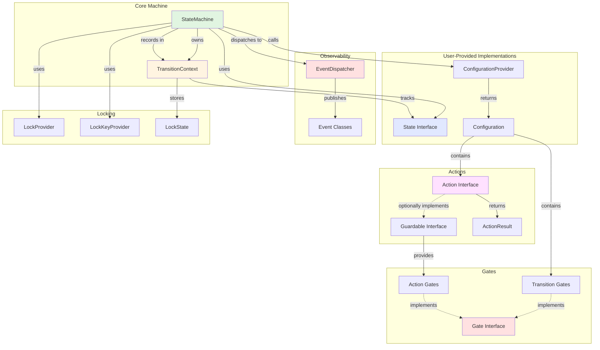
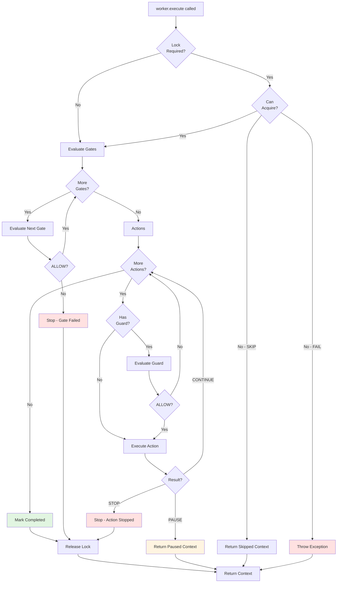

# Flow Diagrams

Visual representations of StateFlow's architecture and execution flow.

## Table of Contents

1. [High-Level Execution Flow](#high-level-execution-flow)
2. [Detailed Transition Lifecycle](#detailed-transition-lifecycle)
3. [Gate Evaluation Flow](#gate-evaluation-flow)
4. [Action Execution Flow](#action-execution-flow)
5. [Pause and Resume Flow](#pause-and-resume-flow)
6. [Race Condition Prevention](#race-condition-prevention)

---

## High-Level Execution Flow



---

## Detailed Transition Lifecycle



## Gate Evaluation Flow

```mermaid
flowchart TD
    Start([Gate Evaluation Starts])
    GateType{Gate Type?}

    TransitionGate[Transition Gate]
    ActionGate[Action Gate]

    CreateContext[Create GateContext<br/>currentState + desiredDelta]

    DispatchBefore[Dispatch: GateEvaluating]
    Evaluate[Call gate.evaluate()]
    DispatchAfter[Dispatch: GateEvaluated]

    RecordTrace[Record in TransitionContext]

    CheckResult{Result?}

    TransitionDeny[Stop Transition<br/>No actions run]
    ActionDeny[Skip This Action<br/>Continue to next]
    Allow[Continue]

    Start --> GateType
    GateType -->|Transition| TransitionGate
    GateType -->|Action| ActionGate

    TransitionGate --> CreateContext
    ActionGate --> CreateContext

    CreateContext --> DispatchBefore
    DispatchBefore --> Evaluate
    Evaluate --> DispatchAfter
    DispatchAfter --> RecordTrace
    RecordTrace --> CheckResult

    CheckResult -->|ALLOW| Allow
    CheckResult -->|DENY + Transition| TransitionDeny
    CheckResult -->|DENY + Action| ActionDeny

    style TransitionDeny fill:#ffe1e1
    style ActionDeny fill:#fff4e1
    style Allow fill:#e1f5e1
    style DispatchBefore fill:#e1e8ff
    style DispatchAfter fill:#e1e8ff
```

---

## Action Execution Flow



---

## Pause and Resume Flow



---

## Race Condition Prevention



---


---

## Component Architecture



---

## Complete Execution Timeline

```mermaid
gantt
    title StateFlow Execution Timeline
    dateFormat X
    axisFormat %L ms

    section Lock
    Acquire Lock           :lock1, 0, 10
    Lock Held             :active, lock2, 10, 190
    Release Lock          :lock3, 190, 200

    section Configuration
    Load Config           :config, 10, 20

    section Transition Gates
    Gate 1 Evaluate       :gate1, 20, 30
    Gate 2 Evaluate       :gate2, 30, 40

    section Actions
    Action 1 Execute      :action1, 40, 80
    Action 2 Execute      :action2, 80, 120
    Action 3 Execute      :action3, 120, 180

    section Events
    TransitionStarting    :milestone, event1, 0, 0
    GateEvaluating x2     :milestone, event2, 25, 25
    ActionExecuting x3    :milestone, event3, 60, 60
    TransitionCompleted   :milestone, event4, 190, 190

    section State
    State: draft          :state1, 0, 80
    State: processing     :active, state2, 80, 180
    State: published      :crit, state3, 180, 200
```

---

## State Machine Decision Tree


