# Observability & Events

## Overview

StateFlow fires events at **every step** of the workflow execution, providing complete visibility into the orchestration process.

## Event Flow

```mermaid
graph TD
    subgraph "Transition Lifecycle Events"
        E1[TransitionStarting]
        E2[TransitionCompleted]
        E3[TransitionPaused]
        E4[TransitionStopped]
        E5[TransitionFailed]
    end

    subgraph "Gate Events"
        G1[GateEvaluating]
        G2[GateEvaluated]
    end

    subgraph "Action Events"
        A1[ActionExecuting]
        A2[ActionExecuted]
        A3[ActionSkipped]
    end

    subgraph "Lock Events"
        L1[LockAcquiring]
        L2[LockAcquired]
        L3[LockReleased]
        L4[LockFailed]
        L5[LockRestored]
        L6[LockLost]
    end

    subgraph "Event Dispatcher"
        D[EventDispatcher.dispatch]
    end

    subgraph "Event Handlers"
        H1[Logger]
        H2[Metrics Collector]
        H3[Audit Trail]
        H4[External Event Bus]
    end

    E1 --> D
    E2 --> D
    E3 --> D
    E4 --> D
    E5 --> D

    G1 --> D
    G2 --> D

    A1 --> D
    A2 --> D
    A3 --> D

    L1 --> D
    L2 --> D
    L3 --> D
    L4 --> D
    L5 --> D
    L6 --> D

    D --> H1
    D --> H2
    D --> H3
    D --> H4

    style D fill:#e1e8ff
    style H1 fill:#ffe1e1
    style H2 fill:#fff4e1
    style H3 fill:#e1ffe1
    style H4 fill:#ffe1ff
```



## Event System

### Interface Definition

```php
interface EventDispatcher
{
    public function dispatch(Event $event): void;
}

abstract class Event
{
    public function __construct(
        public readonly float $timestamp = 0.0,
    ) {
        if ($this->timestamp === 0.0) {
            $this->timestamp = microtime(true);
        }
    }
}
```

### Event Categories

## 1. Transition Lifecycle Events

### TransitionStarting

Fired when a transition begins, **before** gates are evaluated.

```php
class TransitionStarting extends Event
{
    public function __construct(
        public readonly State $currentState,
        public readonly array $desiredDelta,
    ) {
        parent::__construct();
    }
}
```

**Use cases:**
- Log transition attempts
- Start performance timers
- Send monitoring events

### TransitionCompleted

Fired when transition completes successfully.

```php
class TransitionCompleted extends Event
{
    public function __construct(
        public readonly State $finalState,
        public readonly TransitionContext $context,
    ) {
        parent::__construct();
    }
}
```

**Use cases:**
- Audit logging
- Metrics collection
- Trigger downstream workflows
- Cache invalidation

### TransitionPaused

Fired when execution pauses (waiting for async operation).

```php
class TransitionPaused extends Event
{
    public function __construct(
        public readonly State $currentState,
        public readonly TransitionContext $context,
        public readonly mixed $metadata,
    ) {
        parent::__construct();
    }
}
```

**Use cases:**
- Store serialized context
- Schedule resume job
- Update UI status
- Monitoring alerts for long pauses

### TransitionStopped

Fired when execution stops early (gate failed or action stopped).

```php
class TransitionStopped extends Event
{
    public function __construct(
        public readonly State $currentState,
        public readonly TransitionContext $context,
        public readonly mixed $metadata,
    ) {
        parent::__construct();
    }
}
```

**Use cases:**
- Error tracking
- Rollback operations
- User notifications
- Retry scheduling

### TransitionFailed

Fired when an exception occurs during execution.

```php
class TransitionFailed extends Event
{
    public function __construct(
        public readonly State $currentState,
        public readonly \Throwable $exception,
        public readonly TransitionContext $context,
    ) {
        parent::__construct();
    }
}
```

**Use cases:**
- Error logging
- Exception tracking (Sentry, etc.)
- Manual lock release
- Dead letter queue


## 2. Gate Events

### GateEvaluating

Fired **before** a gate is evaluated.

```php
class GateEvaluating extends Event
{
    public function __construct(
        public readonly Gate $gate,
        public readonly GateContext $context,
        public readonly bool $isActionGate,
    ) {
        parent::__construct();
    }
}
```

**Use cases:**
- Debug logging
- Performance tracking
- Inject dynamic data into context

### GateEvaluated

Fired **after** a gate is evaluated.

```php
class GateEvaluated extends Event
{
    public function __construct(
        public readonly Gate $gate,
        public readonly GateContext $context,
        public readonly GateResult $result,
        public readonly bool $isActionGate,
    ) {
        parent::__construct();
    }
}
```

**Use cases:**
- Audit trail
- Failed gate tracking
- Permission violation alerts
- Metrics (gate pass/fail rates)


## 3. Action Events

### ActionExecuting

Fired **before** an action executes.

```php
class ActionExecuting extends Event
{
    public function __construct(
        public readonly Action $action,
        public readonly ActionContext $context,
    ) {
        parent::__construct();
    }
}
```

**Use cases:**
- Performance monitoring
- Pre-action hooks
- State snapshots

### ActionExecuted

Fired **after** an action executes.

```php
class ActionExecuted extends Event
{
    public function __construct(
        public readonly Action $action,
        public readonly ActionContext $context,
        public readonly ActionResult $result,
    ) {
        parent::__construct();
    }
}
```

**Use cases:**
- State change tracking
- Performance measurement
- Post-action hooks
- Integration triggers

### ActionSkipped

Fired when an action is skipped due to gate failure.

```php
class ActionSkipped extends Event
{
    public function __construct(
        public readonly Action $action,
        public readonly GateResult $gateResult,
    ) {
        parent::__construct();
    }
}
```

**Use cases:**
- Debug logging
- Conditional logic tracking
- Business metrics


## 4. Lock Events

### LockAcquiring

Fired when attempting to acquire a lock.

```php
class LockAcquiring extends Event
{
    public function __construct(
        public readonly string $lockKey,
        public readonly State $state,
    ) {
        parent::__construct();
    }
}
```

### LockAcquired

Fired when lock is successfully acquired.

```php
class LockAcquired extends Event
{
    public function __construct(
        public readonly string $lockKey,
        public readonly State $state,
    ) {
        parent::__construct();
    }
}
```

### LockReleased

Fired when lock is released.

```php
class LockReleased extends Event
{
    public function __construct(
        public readonly string $lockKey,
        public readonly State $state,
    ) {
        parent::__construct();
    }
}
```

### LockFailed

Fired when lock acquisition fails.

```php
class LockFailed extends Event
{
    public function __construct(
        public readonly string $lockKey,
        public readonly State $state,
        public readonly string $reason,
    ) {
        parent::__construct();
    }
}
```

### LockRestored

Fired when resuming with an existing lock.

```php
class LockRestored extends Event
{
    public function __construct(
        public readonly string $lockKey,
        public readonly State $state,
    ) {
        parent::__construct();
    }
}
```

### LockLost

Fired when resuming but lock no longer exists.

```php
class LockLost extends Event
{
    public function __construct(
        public readonly string $lockKey,
        public readonly State $state,
    ) {
        parent::__construct();
    }
}
```

**Lock event use cases:**
- Deadlock detection
- Lock contention metrics
- Race condition monitoring
- Debug lock expiration issues


## Implementation Examples

### Simple Logging Dispatcher

```php
class LoggingEventDispatcher implements EventDispatcher
{
    public function dispatch(Event $event): void
    {
        $name = $event::class;
        $timestamp = date('Y-m-d H:i:s', (int)$event->timestamp);

        Log::info("[{$timestamp}] {$name}", [
            'event' => $event,
        ]);
    }
}
```

### Pattern-Matched Dispatcher

```php
class PatternMatchedDispatcher implements EventDispatcher
{
    public function dispatch(Event $event): void
    {
        match (true) {
            $event instanceof TransitionStarting => $this->onTransitionStarting($event),
            $event instanceof TransitionCompleted => $this->onTransitionCompleted($event),
            $event instanceof TransitionFailed => $this->onTransitionFailed($event),
            $event instanceof GateEvaluating => $this->onGateEvaluating($event),
            $event instanceof GateEvaluated => $this->onGateEvaluated($event),
            $event instanceof ActionExecuting => $this->onActionExecuting($event),
            $event instanceof ActionExecuted => $this->onActionExecuted($event),
            $event instanceof LockAcquired => $this->onLockAcquired($event),
            $event instanceof LockFailed => $this->onLockFailed($event),
            default => null,
        };
    }

    private function onTransitionStarting(TransitionStarting $event): void
    {
        Log::info('Transition starting', [
            'currentState' => $event->currentState->toArray(),
            'desiredDelta' => $event->desiredDelta,
        ]);
    }

    private function onTransitionCompleted(TransitionCompleted $event): void
    {
        Log::info('Transition completed', [
            'finalState' => $event->finalState->toArray(),
            'gatesEvaluated' => count($event->context->getGateEvaluations()),
            'actionsExecuted' => count($event->context->getActionExecutions()),
        ]);
    }

    private function onTransitionFailed(TransitionFailed $event): void
    {
        Log::error('Transition failed', [
            'exception' => $event->exception->getMessage(),
            'state' => $event->currentState->toArray(),
            'trace' => $event->exception->getTraceAsString(),
        ]);

        // Send to error tracking
        report($event->exception);
    }

    // ... other handlers
}
```

### Multi-Channel Dispatcher

```php
class MultiChannelDispatcher implements EventDispatcher
{
    public function __construct(
        private LoggerInterface $logger,
        private MetricsCollector $metrics,
        private EventBus $eventBus,
    ) {}

    public function dispatch(Event $event): void
    {
        // Log everything
        $this->logger->info($event::class, ['event' => $event]);

        // Send metrics
        $this->dispatchMetrics($event);

        // Publish to event bus for external consumers
        $this->eventBus->publish($event);
    }

    private function dispatchMetrics(Event $event): void
    {
        match (true) {
            $event instanceof GateEvaluated => $this->metrics->increment('gates.evaluated', [
                'gate' => $event->gate::class,
                'result' => $event->result->name,
                'type' => $event->isActionGate ? 'action' : 'transition',
            ]),
            $event instanceof ActionExecuted => $this->metrics->timing('actions.duration', [
                'action' => $event->action::class,
            ]),
            $event instanceof LockFailed => $this->metrics->increment('locks.failed', [
                'key' => $event->lockKey,
            ]),
            default => null,
        };
    }
}
```

### Performance Monitoring Dispatcher

```php
class PerformanceMonitoringDispatcher implements EventDispatcher
{
    private array $timers = [];

    public function dispatch(Event $event): void
    {
        match (true) {
            $event instanceof TransitionStarting => $this->startTimer('transition'),
            $event instanceof TransitionCompleted => $this->endTimer('transition'),

            $event instanceof GateEvaluating => $this->startTimer("gate:{$event->gate::class}"),
            $event instanceof GateEvaluated => $this->endTimer("gate:{$event->gate::class}"),

            $event instanceof ActionExecuting => $this->startTimer("action:{$event->action::class}"),
            $event instanceof ActionExecuted => $this->endTimer("action:{$event->action::class}"),

            default => null,
        };
    }

    private function startTimer(string $key): void
    {
        $this->timers[$key] = microtime(true);
    }

    private function endTimer(string $key): void
    {
        if (isset($this->timers[$key])) {
            $duration = (microtime(true) - $this->timers[$key]) * 1000; // ms
            Log::debug("Performance: {$key}", ['duration_ms' => $duration]);
            unset($this->timers[$key]);
        }
    }
}
```

### Audit Trail Dispatcher

```php
class AuditTrailDispatcher implements EventDispatcher
{
    public function __construct(
        private AuditLog $auditLog,
        private ?User $user = null,
    ) {}

    public function dispatch(Event $event): void
    {
        if ($event instanceof TransitionCompleted) {
            $this->auditLog->record([
                'user_id' => $this->user?->id,
                'action' => 'state_transition',
                'before' => $event->context->getDesiredDelta(), // What changed
                'after' => $event->finalState->toArray(),
                'gates_evaluated' => $event->context->getGateEvaluations(),
                'actions_executed' => $event->context->getActionExecutions(),
                'timestamp' => $event->timestamp,
            ]);
        }

        if ($event instanceof GateEvaluated && $event->result === GateResult::DENY) {
            $this->auditLog->record([
                'user_id' => $this->user?->id,
                'action' => 'permission_denied',
                'gate' => $event->gate::class,
                'message' => $event->gate->message(),
                'state' => $event->context->currentState->toArray(),
                'timestamp' => $event->timestamp,
            ]);
        }
    }
}
```

### Debug/Development Dispatcher

```php
class DebugDispatcher implements EventDispatcher
{
    public function dispatch(Event $event): void
    {
        $name = class_basename($event);
        $time = date('H:i:s.u', (int)$event->timestamp);

        echo "[{$time}] {$name}\n";

        match (true) {
            $event instanceof GateEvaluating => echo "  → Evaluating: {$event->gate::class}\n",
            $event instanceof GateEvaluated => echo "  → Result: {$event->result->name}\n",
            $event instanceof ActionExecuting => echo "  → Executing: {$event->action::class}\n",
            $event instanceof ActionExecuted => echo "  → Status: {$event->result->executionState->name}\n",
            default => null,
        };
    }
}
```


## Use Case: Complete Monitoring Setup

```php
$stateFlow = new StateFlow(
    configProvider: $config,
    eventDispatcher: new MultiChannelDispatcher(
        logger: app(LoggerInterface::class),
        metrics: app(MetricsCollector::class),
        eventBus: app(EventBus::class),
    ),
    lockProvider: $lockProvider,
    lockKeyProvider: $lockKeyProvider,
);

// Now you get:
// 1. Complete logs of every step
// 2. Metrics on gate pass rates, action duration, lock contention
// 3. Events published for external systems to react to
// 4. Full audit trail for compliance
```


## Benefits

1. **Debugging** - See exactly what happened and when
2. **Monitoring** - Track performance and errors in production
3. **Auditing** - Complete history for compliance
4. **Integration** - Trigger downstream systems via events
5. **Testing** - Verify correct execution order and state changes
6. **Metrics** - Business intelligence on workflow patterns
